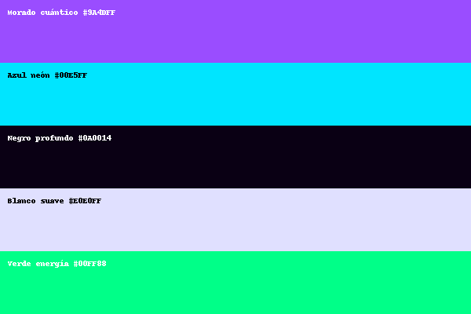
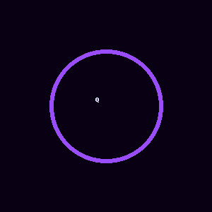

# 🌌 Quantika — un mini lenguaje con IA educativa


---

## 🚀 Página Oficial
👉 [Ver página de Quantika](https://robi2025.github.io/Quantika/)

---

## 🎨 Identidad Visual
- 
- Logo animado:  
  

---

## 🎬 Video Demo
[▶️ Ver demo](assets/quantika-demo.mp4)

---

## 🚀 Ejemplo rápido
```qk
print "Hola Quantika!"
let nombre = "Viviana"
print "Bienvenida, {nombre}"
labels = ["positivo","negativo","neutro"]
ai.classify text: "este servicio es excelente", labels: labels -> sentimiento
print "Sentimiento: {sentimiento}"
```

---
