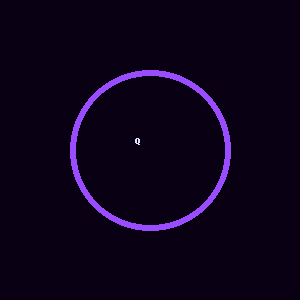

# 🌌 Quantika — a tiny AI-flavored toy language


---

## 🚀 Official Website
👉 [Visit Quantika Website](https://robi2025.github.io/Quantika/)

---

## 🎬 Demo Video
[▶️ Watch the demo](assets/quantika-demo.mp4)

---

## 🎨 Visual Identity
- 
- Animated logo:  
  

---

## Quick Example
```qk
print "Hola Quantika!"
let nombre = "Viviana"
print "Bienvenida, {nombre}"
labels = ["positivo","negativo","neutro"]
ai.classify text: "este servicio es excelente", labels: labels -> sentimiento
print "Sentimiento: {sentimiento}"
```

---

## Run
```bash
python quantika.py run examples/hello.qk
python quantika.py run examples/ai_demo.qk
```
