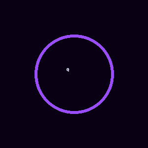
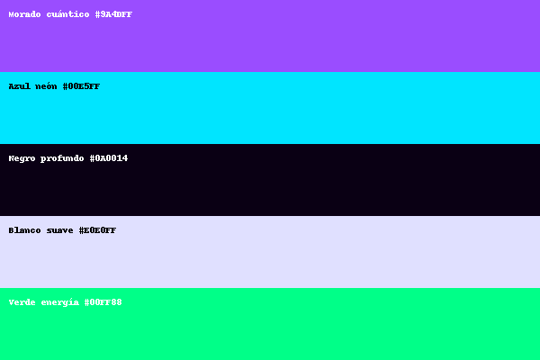

<link href="./tron.css" rel="stylesheet">

  <button id="themeToggle">🌙 Dark</button>
  <label for="accentSel">🎨 Acento:</label>
  <select id="accentSel">
    <option value="tron">Tron (cian + verde)</option>
    <option value="quantika">Quantika (morado + cian)</option>
    <option value="sunset">Sunset (rosa + naranja)</option>
    <option value="ice">Hielo (azules)</option>
  </select>
  <button id="presentBtn">🎤 Modo Presentación</button>

  
  

    <a class="tron-btn" href="./playground.html">⚡ Abrir Playground</a>
    <a class="tron-btn" href="assets/quantika-demo.mp4" download style="margin-left:8px">⬇ Descargar Demo (MP4)</a>
  

  <video controls class="hide-when-present" style="width:100%">
    <source src="assets/quantika-demo.mp4" type="video/mp4">
    Tu navegador no soporta el tag de video.
  </video>

  <h2>🎨 Kit visual</h2>
  

    
    
  

<h3>🧪 Ejemplo</h3>
<pre><code>print "Hola Quantika!"
let nombre = "Viviana"
print "Bienvenida, {nombre}"</code></pre>

